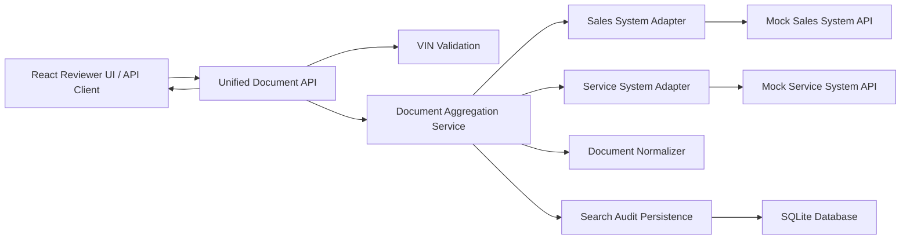

# System Design Blueprint: Unified Document Viewer

## Recommended Implementation Choice

Implement the backend fully and provide a focused React reviewer UI.

This best demonstrates the engineering skills most relevant to Scenario D:

- API design.
- External system integration.
- Parallel data aggregation.
- Failure handling.
- Persistence.
- Observability.
- Automated tests around business logic.
- A small UI that proves the API contract with complete, empty, partial, and failed states.

## Technology Choices

Recommended stack:

- Runtime: Node.js.
- Language: TypeScript.
- HTTP framework: Fastify.
- Database: SQLite for local persistence.
- Query layer: direct `better-sqlite3` repository for the small audit schema.
- Frontend: Vite, React, Tailwind CSS, and shadcn-style components.
- Tests: Vitest, React Testing Library, Fastify injection, HTTP `fetch` E2E coverage, and Playwright UI E2E.
- Logging: pino structured logging.

Justification:

- TypeScript keeps API contracts and normalized document types explicit.
- SQLite is simple for a take-home challenge while still satisfying persistence requirements.
- Fastify is familiar, fast to review, and easy to run locally.
- A direct SQLite repository avoids ORM setup overhead for a single audit table.
- React + shadcn-style components keep the UI implementation focused while still polished enough for a reviewer demo.
- Vitest keeps tests easy for reviewers to run.
- Structured logs support the observability requirement without adding infrastructure.

## High-Level Architecture



## Main API Contract

Endpoint:

```http
GET /api/vehicles/:vin/documents
```

Successful response:

```json
{
  "requestId": "4f3779f4-5a3d-4cb6-8a70-fb65798c0792",
  "vin": "1HGCM82633A004352",
  "status": "complete",
  "documents": [
    {
      "id": "service:service-7001",
      "externalId": "service-7001",
      "source": "SERVICE_SYSTEM",
      "type": "SERVICE_INVOICE",
      "title": "12 month service invoice",
      "documentDate": "2026-01-15T09:10:00.000Z",
      "customerName": "Alex Morgan",
      "metadata": {
        "repairOrderNumber": "RO-7001",
        "duplicateKey": null
      }
    }
  ],
  "warnings": [],
  "upstream": [
    {
      "source": "SALES_SYSTEM",
      "status": "success",
      "latencyMs": 15,
      "documentCount": 2
    },
    {
      "source": "SERVICE_SYSTEM",
      "status": "success",
      "latencyMs": 20,
      "documentCount": 2
    }
  ]
}
```

Partial response:

```json
{
  "requestId": "95e45817-7994-47f8-b3a8-b0cc3bdf58ff",
  "vin": "1HGCM82633A00435S",
  "status": "partial",
  "documents": [
    {
      "id": "service:service-9001",
      "externalId": "service-9001",
      "source": "SERVICE_SYSTEM",
      "type": "SERVICE_INVOICE",
      "title": "Service invoice",
      "documentDate": "2025-06-01T09:00:00.000Z",
      "customerName": "Jordan Lee",
      "metadata": {
        "repairOrderNumber": "RO-9001"
      }
    }
  ],
  "warnings": [
    {
      "code": "UPSTREAM_ERROR",
      "source": "SALES_SYSTEM",
      "message": "Sales System API failed"
    }
  ],
  "upstream": [
    {
      "source": "SALES_SYSTEM",
      "status": "failed",
      "latencyMs": 16,
      "documentCount": 0,
      "errorCode": "UPSTREAM_ERROR"
    },
    {
      "source": "SERVICE_SYSTEM",
      "status": "success",
      "latencyMs": 21,
      "documentCount": 1
    }
  ]
}
```

Invalid VIN response:

```json
{
  "code": "INVALID_VIN",
  "message": "VIN must be 17 characters and use allowed VIN characters."
}
```

## Mock Upstream Systems

The Sales and Service systems are implemented as adapter modules rather than public HTTP routes. This keeps the submitted backend focused on the unified API while still modelling external systems with different payload shapes, latency, failures, and timeouts.

Sales example:

```json
{
  "vin": "1HGCM82633A004352",
  "salesDocuments": [
    {
      "dealId": "D-1001",
      "documentId": "sales-1001",
      "documentType": "SALES_CONTRACT",
      "name": "Vehicle sales contract",
      "createdAt": "2025-11-03T10:30:00.000Z",
      "buyerName": "Example Customer"
    }
  ]
}
```

Service example:

```json
{
  "vehicleVin": "1HGCM82633A004352",
  "records": [
    {
      "repairOrderNumber": "RO-9001",
      "fileRef": "service-9001",
      "category": "SERVICE_INVOICE",
      "displayName": "Service invoice",
      "completedOn": "2026-01-15T09:00:00.000Z"
    }
  ]
}
```

## Persistence Model

Persist search audit records, not the full document corpus.

Minimum audit fields:

- `id`
- `request_id`
- `vin`
- `status`: `complete`, `partial`, `failed`
- `result_count`
- `warning_count`
- `latency_ms`
- `upstream_json`
- `created_at`

Why this is enough:

- It satisfies the persistence requirement.
- It supports observability and troubleshooting.
- It avoids pretending that mocked upstream documents are authoritative local data.

## Failure Handling

Rules:

- Invalid VIN returns HTTP 400 and no upstream calls.
- One upstream failure returns HTTP 200 with `status: "partial"` and warning metadata.
- Both upstream failures return HTTP 502 with controlled error metadata.
- Upstream timeout is treated as a failed upstream.
- No documents from successful upstreams returns HTTP 200 with an empty `documents` array.

## Observability Strategy

Log structured workflow events so one VIN search can be traced in the backend terminal by `requestId`.

Workflow events:

- `document_search_started`
- `upstream_document_search_completed`
- `search_audit_persisted`
- `document_search_completed`
- `document_search_rejected`

Request/completion log fields:

- `requestId`
- `vin`
- `status`
- `resultCount`
- `warningCount`
- `latencyMs`
- `upstream`

Upstream log fields:

- `requestId`
- `vin`
- `source`
- `status`
- `latencyMs`
- `documentCount`
- `failureReason`

This gives enough visibility for a local challenge while explaining how it could evolve into metrics and tracing in production.

## AI-Assisted Development Strategy

Use AI for:

- Comparing architecture options.
- Generating initial API contract drafts.
- Creating test case lists.
- Reviewing edge cases.
- Producing boilerplate for server setup and tests.

Human-owned verification:

- Confirm the final API contract.
- Inspect generated code for correctness and maintainability.
- Add or refine tests for partial failure, invalid VIN, sorting, deduplication, and persistence.
- Run the full test suite before submission.
- Document assumptions and trade-offs clearly.
