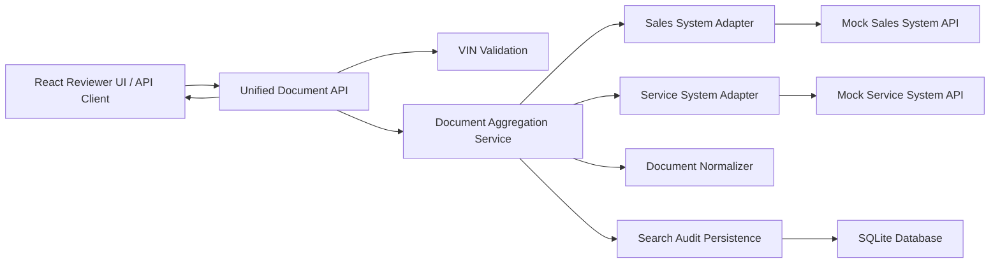

# System Design: Unified Document Viewer

## Implementation Choice

Implement the backend fully and provide a focused React reviewer UI.

Scenario D is mainly an integration problem. The hard parts are the API contract, upstream failure handling, normalization, audit persistence, and traceable backend behavior. The React UI is included to make the API easy to review, but it is not the primary assessment layer.

The backend covers:

- VIN validation and REST API behavior.
- Parallel calls to mocked Sales and Service systems.
- Source-specific normalization into one document model.
- Partial failure and timeout handling.
- SQLite-backed search audit records.
- Readable request and workflow logs.
- Tests for the business cases in Scenario D.

## Technology Choices

- Runtime: Node.js.
- Language: TypeScript.
- HTTP framework: Fastify.
- Database: SQLite for local persistence.
- Query layer: direct `better-sqlite3` repository for the small audit schema.
- Frontend: Vite, React, Tailwind CSS, and shadcn-style components.
- Tests: Vitest, React Testing Library, Fastify injection, HTTP `fetch` E2E coverage, and Playwright UI E2E.
- Logging: pino with a readable one-line formatter.

Trade-offs:

- TypeScript keeps API contracts and normalized document types explicit.
- SQLite is enough for local audit persistence without adding a separate database service.
- Fastify keeps the API small and gives useful test support through request injection.
- A direct SQLite repository avoids ORM setup overhead for a single audit table.
- React + shadcn-style components provide a thin reviewer client for the same API contract.
- Vitest keeps the backend and UI tests in one toolchain.
- Text logs are easier to read during the demo while still carrying request IDs, VINs, source names, status, latency, and counts.

## High-Level Architecture



## Main API Contract

Endpoint:

```http
GET /api/vehicles/:vin/documents
```

Successful response:

```json
{
  "requestId": "4f3779f4-5a3d-4cb6-8a70-fb65798c0792",
  "vin": "1HGCM82633A004352",
  "status": "complete",
  "documents": [
    {
      "id": "service:service-7001",
      "externalId": "service-7001",
      "source": "SERVICE_SYSTEM",
      "type": "SERVICE_INVOICE",
      "title": "12 month service invoice",
      "documentDate": "2026-01-15T09:10:00.000Z",
      "customerName": "Alex Morgan",
      "metadata": {
        "repairOrderNumber": "RO-7001",
        "duplicateKey": null
      }
    }
  ],
  "warnings": [],
  "upstream": [
    {
      "source": "SALES_SYSTEM",
      "status": "success",
      "latencyMs": 15,
      "documentCount": 2
    },
    {
      "source": "SERVICE_SYSTEM",
      "status": "success",
      "latencyMs": 20,
      "documentCount": 2
    }
  ]
}
```

Partial response:

```json
{
  "requestId": "95e45817-7994-47f8-b3a8-b0cc3bdf58ff",
  "vin": "1HGCM82633A00435S",
  "status": "partial",
  "documents": [
    {
      "id": "service:service-9001",
      "externalId": "service-9001",
      "source": "SERVICE_SYSTEM",
      "type": "SERVICE_INVOICE",
      "title": "Service invoice",
      "documentDate": "2025-06-01T09:00:00.000Z",
      "customerName": "Jordan Lee",
      "metadata": {
        "repairOrderNumber": "RO-9001"
      }
    }
  ],
  "warnings": [
    {
      "code": "UPSTREAM_ERROR",
      "source": "SALES_SYSTEM",
      "message": "Sales System API failed"
    }
  ],
  "upstream": [
    {
      "source": "SALES_SYSTEM",
      "status": "failed",
      "latencyMs": 16,
      "documentCount": 0,
      "errorCode": "UPSTREAM_ERROR"
    },
    {
      "source": "SERVICE_SYSTEM",
      "status": "success",
      "latencyMs": 21,
      "documentCount": 1
    }
  ]
}
```

Invalid VIN response:

```json
{
  "code": "INVALID_VIN",
  "message": "VIN must be 17 characters and use allowed VIN characters."
}
```

## Mock Upstream Systems

The Sales and Service systems are implemented as adapter modules rather than public HTTP routes. This keeps the submitted backend focused on the unified API while still modelling external systems with different payload shapes, latency, failures, and timeouts.

Sales example:

```json
{
  "vin": "1HGCM82633A004352",
  "salesDocuments": [
    {
      "dealId": "D-1001",
      "documentId": "sales-1001",
      "documentType": "SALES_CONTRACT",
      "name": "Vehicle sales contract",
      "createdAt": "2025-11-03T10:30:00.000Z",
      "buyerName": "Example Customer"
    }
  ]
}
```

Service example:

```json
{
  "vehicleVin": "1HGCM82633A004352",
  "records": [
    {
      "repairOrderNumber": "RO-9001",
      "fileRef": "service-9001",
      "category": "SERVICE_INVOICE",
      "displayName": "Service invoice",
      "completedOn": "2026-01-15T09:00:00.000Z"
    }
  ]
}
```

## Persistence Model

Persist search audit records, not the full document corpus.

Audit fields:

- `id`
- `request_id`
- `vin`
- `status`: `complete`, `partial`, `failed`
- `result_count`
- `warning_count`
- `latency_ms`
- `upstream_json`
- `created_at`

The upstream documents remain owned by the mocked Sales and Service systems. The local database records what was searched, how the upstreams behaved, and what the API returned.

## Failure Handling

Rules:

- Invalid VIN returns HTTP 400 and no upstream calls.
- One upstream failure returns HTTP 200 with `status: "partial"` and warning metadata.
- Both upstream failures return HTTP 502 with controlled error metadata.
- Upstream timeout is treated as a failed upstream.
- No documents from successful upstreams returns HTTP 200 with an empty `documents` array.

## Observability Strategy

The API writes one-line readable logs. Each VIN search can be followed by `requestId`, and each upstream call logs its source, status, latency, and document count.

Workflow events:

- `document_search_started`
- `upstream_document_search_completed`
- `search_audit_persisted`
- `document_search_completed`
- `document_search_rejected`

Request/completion log fields:

- `requestId`
- `vin`
- `status`
- `resultCount`
- `warningCount`
- `latencyMs`
- `upstream`

Upstream log fields:

- `requestId`
- `vin`
- `source`
- `status`
- `latencyMs`
- `documentCount`
- `failureReason`

For a larger deployment, the same fields could be sent to a log pipeline or converted into metrics. In this submission they are visible directly in the backend terminal and persisted as search audit records.

## GenAI Use During Design

I used AI during design to speed up exploration, not to make final decisions. The useful parts were:

- Comparing backend-first and frontend-first approaches.
- Drafting candidate API response shapes.
- Listing failure cases: partial upstream failure, timeout, empty results, duplicate documents, and invalid VINs.
- Checking whether the test plan covered the Scenario D behavior.

I kept the design narrow after that review:

- One public document-search endpoint.
- Mocked upstream systems behind adapters.
- Search audit persistence instead of storing mocked documents as local truth.
- Tests and manual checks before treating the implementation as complete.
